 ### Configuration Management (CM)
* There are two types of CM
   * Pull based CM
   * Push Based CM
* Direction of Communication
   * PULL => Node to CM server
   * Push => CM Server to Node
   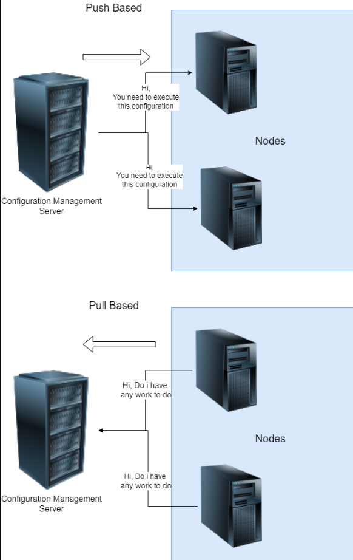
* What is required in PULL Based CM?
   * Agent needs to be installed with necessary credentials to connect to CM Server
* What is required in Push Based CM
   * List of nodes (inventory)
   * Credentials to login into node
   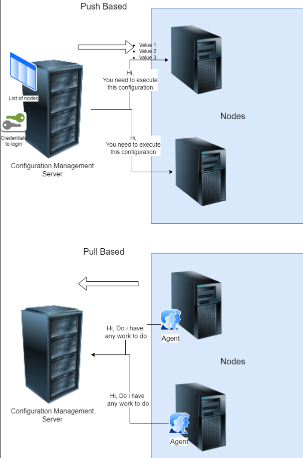
* Popular tools
   * Pull:
      * Chef
      * Puppet
   * Push:
      * Ansible
      * SaltStack
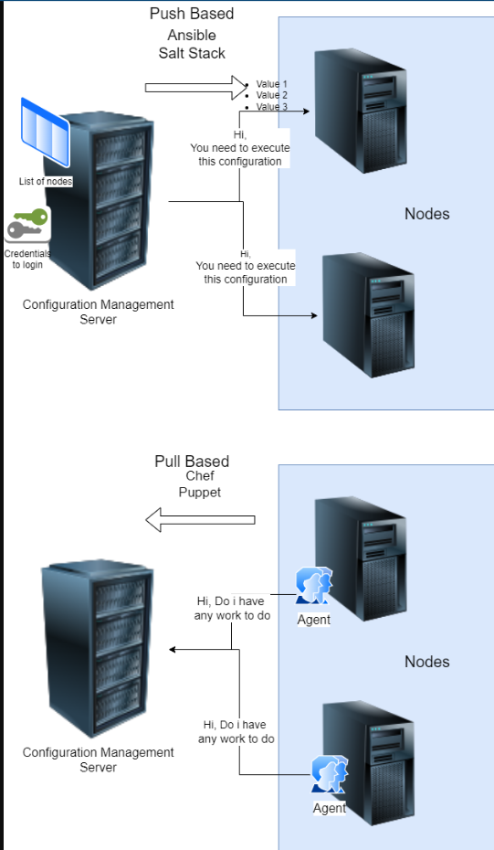

### Ansible
### Architecture and workflow
* Basic workflow
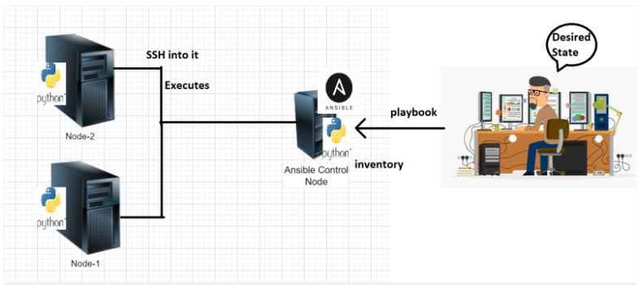
* Ansible control node can execute desired state on nodes using
    * adhoc commands
    * playbooks
* Playbooks are YAML files.

###*  How Operations Team work on multiple servers
* Organizations will have lot of servers and lot of admins
* Creating individual logins on each server for every admin is not a feasible solution.
* An effective way is organization creates a service account for the admins to login and perform administration.
* For the lab activities our service account’s name would be devops
* Having username and password is not a sensible option then how to solve this problem

### Ansible installation
* [refer Here](https://docs.ansible.com/ansible/latest/installation_guide/installation_distros.html#installing-ansible-on-ubuntu) for official docs.
* Create two instances one is ansible and other is node
* Enable password authentication to yes In both machines `sudo vi /etc/ssh/sshd_config`
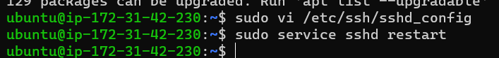
* Create a user called devops in both the machines `sudo adduser devops`
* Provide sudo permissions in both machines `sudo vi /etc/sudoers`
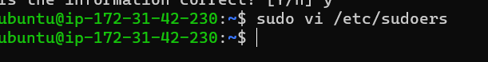
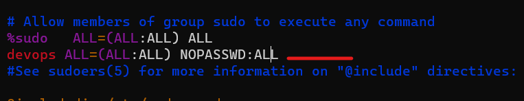
* Now exit from both the machines and login with devops user ` ssh devops@<public ip of machine>`
* Now , install ansible on ansible vm as devops user
* Follow the below commands in order to or create a file and execute all commands.
```
#!/bin/bash
sudo apt update
sudo apt install software-properties-common -y
sudo add-apt-repository --yes --update ppa:ansible/ansible
sudo apt install ansible -y
```
* Check ansible version 
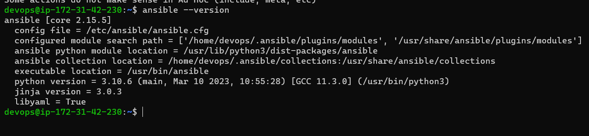
* Generate ssh-keygen in ansible devops user
* In ansible machine do` ssh-copy-id devops@<private ip of node> `
* Now exit from node machine in ansible
* Stay in ansible devops user
* Create an inventory folder  
* Create  a file in inventory with name hosts and add private ip of the node and ping to check the connection. `ansible -m ping -i hosts all`
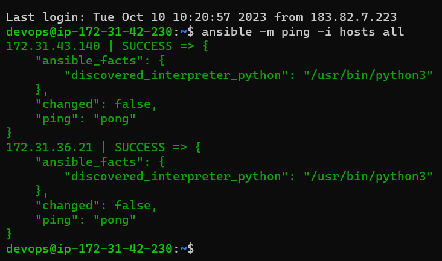 

###  Activity 1
* write a playbook to install tree
[Refer Here](https://github.com/jagadeesh9666/Ansible/commit/9a94bb68e66a94f913178585c42b9eb57210ee4e) for playbook
* Run the command `ansible-playbook -i <inventory-path> <playbook-path>`
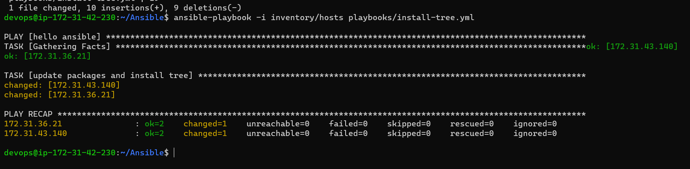

### Activity 2: Installing lamp server on ubuntu
* Note: we will skip mysql installation for now
* Manual steps are
```
sudo apt update
sudo apt install apache2 -y
sudo apt install php libapache2-mod-php php-mysql -y
# Create a file called as /var/www/html/info.php with below content
# <?php phpinfo(); ?>
sudo -i
echo '<?php phpinfo(); ?>' > /var/www/html/info.php
exit
sudo systemctl restart apache2
```
* Check for syntax of playbook
` ansible-playbook -i <inventory-path> --syntax-check <playbook-path> `
[Refer Here](https://github.com/jagadeesh9666/Ansible/commit/42459ac18c4853dc042b8a28ed40d1158547d0ee?diff=split) for playbook
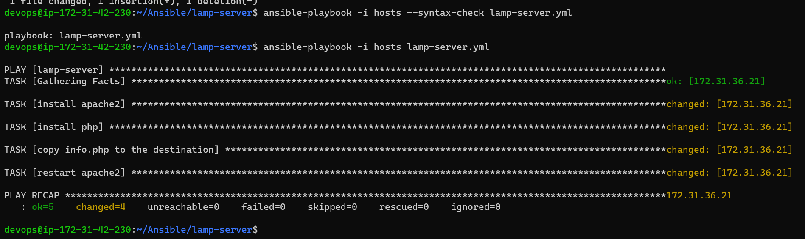
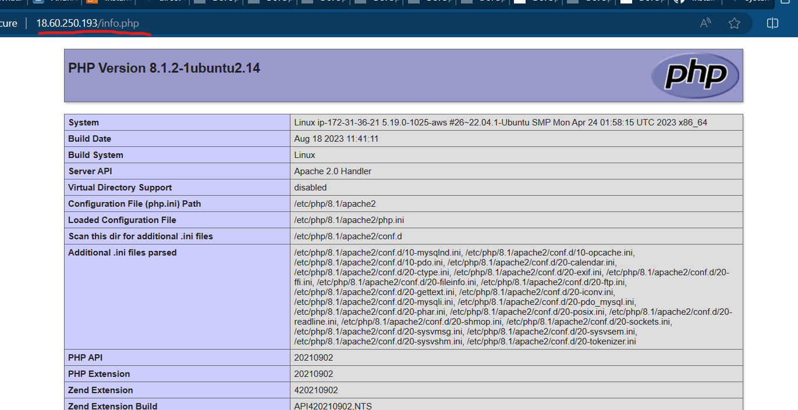
* when i executed the same playbook again the apache server is getting restarted

### Ansible Handlers
Handlers: [Refer Here](https://docs.ansible.com/ansible/latest/playbook_guide/playbooks_handlers.html#handlers)
[Refer Here](https://github.com/jagadeesh9666/Ansible/commit/8d60f7142679678100ebb8e1e18a47cc5700a19a) for the changes with handlers included
* Info.php copying step changed i.e. copied the file to meet desired state so restart executed

### Inventory
* Inventory in Ansible represents the hosts which we need to connect to.
* Ansible inventory is broadly classified into two types
     * static inventory: where we mention the list of nodes to connect to in some file
     * dynamic inventory: where we mention some script/plugin which will dynamically find out the nodes to connect to
* As of now lets focus on static inventory
* [Refer Here](https://docs.ansible.com/ansible/latest/inventory_guide/intro_inventory.html#inventory-basics-formats-hosts-and-groups) for official docs on Ansible inventory
* Static inventory can be mentioned in two formats
     * ini
     * yaml
* Ini format: [Refer Here](https://en.wikipedia.org/wiki/INI_file#:~:text=An%20INI%20file%20is%20a,sections%20that%20organize%20the%20properties.)
* list hosts `ansible-playbook -i inventory/hosts playbooks/install-tree.yml --list-hosts`
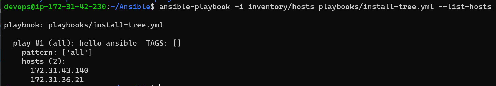

### Facts
* ansible collects information about the node on which it is executing by the help of module called as setup
* Ansible playbook by default collects information about nodes where it is executing, we can use this with the help of variables
* Collecting information can be disabled as well
```
---
- name: do something
  hosts: all
  gather_facts: no
  ...
  ...
```
